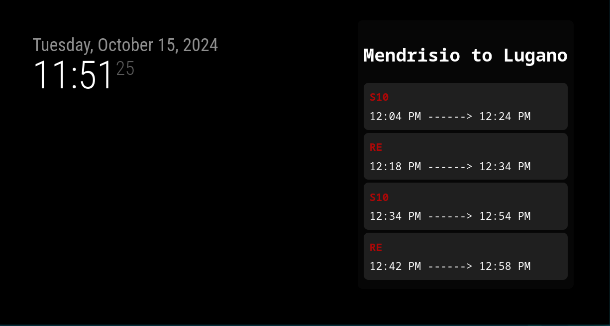

# MMM-FFS
Real Time Public Transportations Infos for Switzerland in your Magic Mirror.

Index
- [MMM-FFS](#mmm-ffs)
  - [Description](#description)
  - [Screenshots](#screenshots)
  - [Installation](#installation)
  - [Configuration](#configuration)
    - [Change the station](#change-the-station)
  - [Station Codes](#station-codes)

## Description

This module shows the real time public transportations infos for Switzerland. The module is based on the [Opendata API](https://transport.opendata.ch/) and it shows the next 4 public transportations from a station to another one. The module is designed to be used in the Magic Mirror project and it's written in JavaScript.

## Screenshots



*In  this example the cities where Mendrisio and Lugano (the default ones) and the widget is in the bottom-right position.*

## Installation

Go inside your Magic Mirror's module folder
```shell
cd ~/MagicMirror/modules
```

Clone the repository
```shell
git clone https://github.com/MatteoArna/MMM-FFS.git
```

Go inside the module folder and install the dependencies
```shell
cd MMM-FFS
npm install
```

Add the module to your Magic Mirror's `config/config.js` file
```javascript
{
    module: 'MMM-FFS',
    position: 'top_left', // Or any other region
}
```

If you restart your Magic Mirror, the module should be working.

## Configuration

### Change the station
You can change the station by adding the `from` and `to` parameters to the module configuration. As default, the module will show the public transportations infos from Mendrisio, Stazione to Lugano, Stazione.
```javascript
{
    module: 'MMM-FFS',
    position: 'top_left',
    config: {
        from: '8579936' // Bellinzona, Stazione
        to: ...
    }
}
```

*The list of the station codes is available [here](#station-codes).*

## Station Codes

The station code indicates the station you want to get the public transportations infos from. These are the main codes of Ticino:
| Code  | Name                         |
| ------- | ---------------------------- |
| 8579936 | Bellinzona, Stazione         |
| 8587122 | Chiasso, Stazione            |
| 8582990 | Giubiasco, Stazione          |
| 8594370 | Locarno, Piazza Stazione     |
| 8578881 | Locarno, Stazione            |
| 8505380 | Lugano, Stazione             |
| 8530462 | Lugano Stazione (funicolare) |
| 8591805 | Lugano, Stazione Nord        |
| 8575573 | Mendrisio, Stazione          |
| 8581644 | Paradiso, Stazione/Scuole    |

